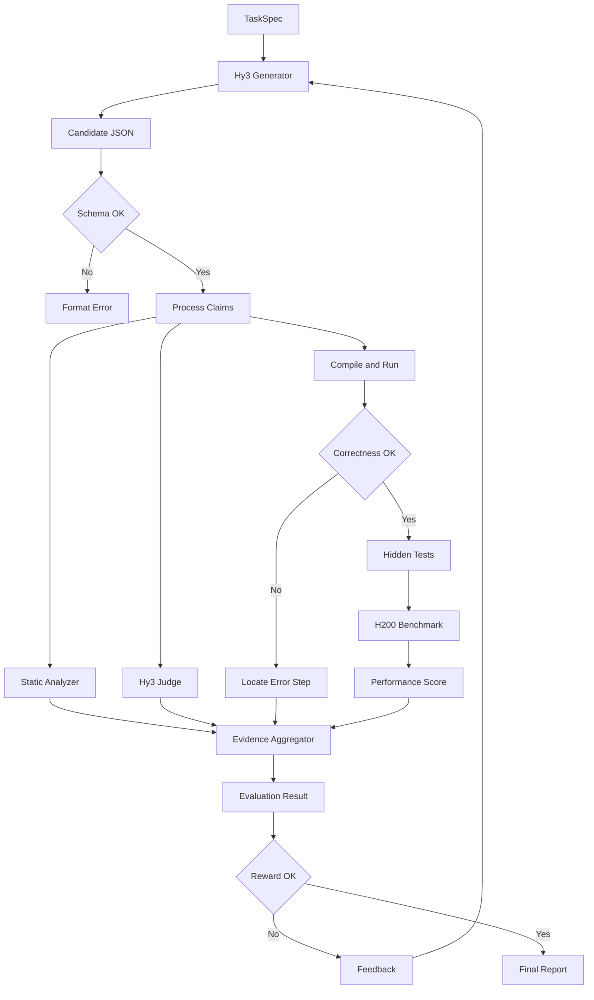

# KernelScope-Hy3: Process-Guided Test-Time GPU Kernel Optimization

**面向推理引擎 GPU 算子生成的过程评估、错误定位与测试时优化系统**

KernelScope-Hy3 是一个面向推理引擎 GPU 算子生成的可验证应用，题集从 SGLang、Miles、FlashInfer、TileLang 和 Tencent HPC-Ops 等工业界项目中抽取核心算子语义，再重构为独立可校验任务。系统把算子需求、结构化工程决策、源码证据、独立 oracle、H200 执行结果和性能基线串成一条可审计链路，并在测试时通过多候选搜索和反馈迭代选择更好的 kernel。

本仓库当前定位为 **Hy3 应用的评估与测试时优化底座**：题集、oracle、过程静态检查、性能基线、受控错误集、评分器和 Test-Time Search 已完成；Hy3 Generator/Judge 的 HTTP 接入（`kernelscope.providers`/`kernelscope.judge`）已跑通端到端闭环，细节见第 7 节。接入只实现 provider/adapter，不改变下层评估协议，因此可以在不训练或微调模型的前提下完成端到端应用。

## Abstract

GPU kernel generation cannot be evaluated by functional tests alone: a candidate may pass weak inputs while violating its claimed optimization, numerical assumptions, or hardware support domain. KernelScope-Hy3 defines the process as an auditable engineering decision chain and combines structured generation, static claim evidence, independent numerical oracles, hidden/metamorphic tests, and H200 measurements.

## Contributions

- **Process-level protocol**：用带步骤依赖和 evidence claims 的 JSON schema 表达可审计过程。
- **Evidence aggregation**：静态源码证据、correctness gate 和真实 H200 执行结果共同决定过程有效性。
- **Error localization**：定位最早矛盾步骤，区分 SPEC、ALGO、NUM、MEM、SYNC、IMPL 等错误。
- **False-validity detection**：覆盖结果正确但过程错误、弱测试通过和 provider 支持域不足。
- **Reproducible scoring**：clean GPU、CV 门禁、reference envelope 和最差 shape 约束。
- **Test-time optimization**：Best-of-N、self-refinement 和结构化 reward，不更新模型权重。

## 1. 仓库结构

```text
hy/
├── src/kernelscope/
│   ├── models.py              # TaskSpec、Generation、Evidence、EvaluationResult
│   ├── schema.py              # Generator JSON 协议校验
│   ├── tasks.py               # 17 个推理引擎算子任务目录
│   ├── cases.py               # 正确性 case：公开、隐藏、变形标签
│   ├── harness.py             # 输入生成、oracle 对比、误差门禁
│   ├── oracles/               # RMSNorm、Attention、MoE、GEMM、Quantization、KV Cache、Sampling、Softmax
│   ├── claims.py              # thought/code 声明的静态证据检查
│   ├── evaluator.py            # 最早矛盾步骤和错误类型输出
│   ├── benchmark.py            # CUDA Event、median/p10/p90/CV
│   ├── performance.py          # reference envelope 和加权性能评分
│   ├── baselines.py            # 基线 JSON 聚合与有效性过滤
│   ├── metrics.py              # 定位准确率、召回率、Macro-F1 等
│   ├── gpu_audit.py            # nvidia-smi compute PID 审计
│   ├── judge.py                # 独立 Hy3 Judge 证据合并
│   ├── providers/              # 可审计 Triton provider + hy3 client/prompt/runner/gpu_runner
│   └── tools/                 # 采集、评分、manifest、验证集、hy3 生成/搜索/汇总工具
├── datasets/
│   ├── task_manifest.json      # 机器可读题集 manifest
│   ├── validation/             # 72 条受控错误 + 18 条正确/伪正确对照 + 真实 hy3 run 记录
│   └── baselines/              # H200 实测数据和审计说明
├── tests/                     # 74 个自动化测试
├── IMPLEMENTATION_PLAN.md     # 完整设计方案和比赛交付规划
└── pyproject.toml
```

## 过程总览



图中的硬门禁顺序是：schema -> compile -> correctness -> hidden/metamorphic -> performance。性能快但 correctness 失败的候选 reward 为 0；结果正确但声明无法由代码或执行证据支撑的候选会被标记为 `correct_result_invalid_process`。

## 2. 已完成能力

### 题集

当前目录包含 17 个任务，覆盖 SGLang、Miles、FlashInfer、TileLang 和 Tencent HPC-Ops 来源。数据集优先抽取工业界推理引擎中真实出现的核心算子，再将其重写为独立、可校验、可定位错误的任务；上游实现用于确定语义、边界和性能目标，不直接作为模型可见的标准答案。17 个任务全部已达到 `tests_ready`（每个任务都有独立 oracle、`CaseSpec` 覆盖公开/隐藏/边界 case，并接入 `harness.build_case` 和 GPU runner）：

- RMSNorm、Fused Add + RMSNorm、SiLU + Mul
- Attention State Merge、Reduced FlashAttention、Paged Decode Attention
- Top-k/Top-p/Min-p Sampling Filtering、Online Softmax
- MoE Top-k Softmax、MoE Token Alignment
- Tiled GEMM + Bias、Per-Token Group FP8 Quantization
- Paged KV Cache Gather、RoPE + RMSNorm + Paged KV Write
- HPC-Ops Fused RMSNorm + FP8 Scale、HPC-Ops BF16 x FP32 Route GEMM、HPC-Ops Grouped FP8 GEMM

### 数据集组成与来源

题集按“工业来源 -> 算子语义 -> 可验证任务”的流程构建。每道题均保存 `task_id`、输入输出规格、layout/dtype 约束、公开与隐藏 cases、独立 oracle、参考性能 envelope、来源 commit/path 和许可证信息。这样既覆盖真实生产算子，也避免把某个项目的实现细节当成模型必须复述的答案。

| 来源 | 抽取的工业核心算子/能力 | 在题集中的作用 | 标准答案与验证方式 |
|---|---|---|---|
| SGLang | RMSNorm、融合激活、MoE routing、attention state merge | 推理引擎基础路径与融合算子 | 独立 PyTorch/NumPy oracle + CUDA correctness gate + H200 基线 |
| Miles | INT4/量化路径、MoE backward、训练/推理交界算子 | 补充量化、稀疏和反向计算边界 | 规格重写后进入扩展题；需额外标注版本和支持域 |
| FlashInfer | sampling、cascade attention、paged KV、decode 相关 API | 覆盖 KV cache、动态序列和采样 | API 只提供语义参考，oracle 与隐藏测试独立实现 |
| TileLang | tiled GEMM、online softmax、attention 模板 | 覆盖 tile、warp、shared memory 与布局变换 | 题面隐藏模板细节，使用独立 reference envelope 评估性能 |
| Tencent HPC-Ops | FP8 RMSNorm、Route/Grouped GEMM、RoPE/KV、decode attention | 提供工业级高性能与 H200 特性题 | 原生实现仅作 provider baseline；记录 commit、许可证和适配差异 |

目前题集的 17 道任务按 Easy/Medium/Hard 分层，覆盖 elementwise/norm、reduction/softmax、quantization、GEMM/MoE、KV-cache/attention、fusion 六类优化。分层依据包括计算强度、内存访问复杂度、同步原语、动态 shape、数值精度和 H200 特性依赖。公开 cases 用于反馈迭代，隐藏及 metamorphic cases 用于识别弱测试、边界遗漏和“结果正确但过程不成立”。完整来源审计见 [datasets/SOURCES.md](datasets/SOURCES.md)。

题目按 Easy/Medium/Hard 分层，case 覆盖非对齐尺寸、尾部、Inf/极值、FP8、精度残差和 provider 支持域。

### 过程评估

Generator 输出必须包含：

```json
{
  "task_understanding": {},
  "steps": [{"id": "S1", "type": "...", "claim": "...", "evidence_expected": []}],
  "complexity": {},
  "final_kernel": "...",
  "launch_config": {}
}
```

评估器输出四态证据：`verified`、`contradicted`、`insufficient_evidence`、`not_applicable`。当声明与代码矛盾时，输出最早错误步骤和 `IMPL.claim_not_implemented`。真实执行结果应覆盖静态关键词证据。

### H200 性能

已完成 GPU 7 的干净窗口采集。推荐微秒级 kernel 协议：

- warmup: 50
- iterations: 100
- launches per sample: 1000
- 接纳条件：`correctness_gate=true`、`clean_environment=true`、CV <= 0.05

正式 HPC-Ops run 4 结果：

- native RMSNorm 相对 Torch oracle：约 `8.24x`
- native Route GEMM 相对 Torch oracle：约 `1.62x`

详见 [datasets/baselines/README.md](datasets/baselines/README.md)。共享卡或 CV 超限数据永远不会进入正式 reference envelope。

## 3. 快速开始

```bash
cd /opt/sglang-omni-main/hy
python -m venv .venv
source .venv/bin/activate
pip install -e .

PYTHONPATH=src pytest -q
PYTHONPATH=src python -m kernelscope.tools.export_manifest > /tmp/task_manifest.json
PYTHONPATH=src python -m kernelscope.tools.generate_validation_set
```

列出任务：

```bash
PYTHONPATH=src python -m kernelscope --list-tasks
```

## 4. 评估一个 Generator 输出

将符合 schema 的 JSON 保存为 `generation.json`：

```bash
PYTHONPATH=src python -m kernelscope \
  --task rmsnorm \
  --generation generation.json
```

当前 CLI 已完成 schema、静态 claim 和错误步骤定位；GPU 编译/隐藏测试执行器仍应作为下一层应用适配器接入。

## 5. 采集和评分 H200 基线

需要 CUDA、PyTorch、SGLang/FlashInfer；HPC-Ops native 还需要已编译 `_C.abi3.so`。

```bash
CUDA_VISIBLE_DEVICES=7 \
PYTHONPATH=src \
python -m kernelscope.tools.collect_baselines \
  --tasks rmsnorm merge_state sampling online_softmax hpc_rmsnorm_scale \
  --output datasets/baselines/h200_core.json \
  --warmup 50 --iterations 100 --launches-per-sample 1000 \
  --clean-environment
```

HPC-Ops native：

```bash
CUDA_VISIBLE_DEVICES=7 \
HPC_OPS_LIBRARY=/path/to/hpc/_C.abi3.so \
PYTHONPATH=src \
python -m kernelscope.tools.collect_baselines \
  --tasks hpc_rmsnorm_scale hpc_route_gemm \
  --native-hpc --clean-environment \
  --warmup 50 --iterations 100 --launches-per-sample 1000 \
  --output datasets/baselines/h200_hpc.json
```

评分：

```bash
PYTHONPATH=src python -m kernelscope.tools.score_baselines \
  --task hpc_route_gemm \
  --candidate hpc_ops_native_padded \
  --baseline datasets/baselines/h200_hpc.json \
  --correctness-passed
```

## 6. 验证集与指标

受控错误集固定为 6 个任务 x 6 类错误 x 2 个变体，共 72 条；对照集包含 6 条 reference、6 条正确 naive、6 条结果正确但过程错误样本。

错误类型包括 `SPEC`、`ALGO`、`NUM`、`MEM`、`SYNC`、`IMPL`。指标模块计算错误检测召回率、Top-1 定位准确率、结果正确但过程错误召回率和错误类型 Macro-F1。

## 7. Hy3 接入边界

已完成的应用层接入：

1. `providers/hy3_client.py`/`hy3_prompt.py` 通过 UniAPI 的 OpenAI 兼容协议调用真实 hy3（Hunyuan 3）模型作为 Generator，system prompt 要求输出上述 JSON 协议；API key 只放在环境变量，不落盘。
2. `tools/run_hy3_generator.py` 把 Generator 输出交给 `schema.parse_generation`、`evaluator.evaluate_generation`，并在 CPU 上对 `final_kernel` 跑真实的 correctness gate（隔离子进程 + 超时，`providers/hy3_runner.py`），`execution_diagnosis.py` 把执行失败分类进 SPEC/ALGO/NUM/MEM/SYNC/IMPL taxonomy。
3. `providers/hy3_judge_prompt.py`/`judge.py` 实现第二个独立的 hy3 Judge 调用，审查 `task_understanding`、`steps` 依赖链、`complexity` 估计和逐步优化声明是否被 `final_kernel` 支持（对 `claims.py` 纯正则检查的语义补充）；`run_hy3_generator.py --with-judge` 把 Judge 证据与静态分析、correctness 结果合并进同一个 `EvaluationResult`。
4. `providers/hy3_gpu_runner.py`/`tools/run_hy3_gpu.py` 把已通过 CPU correctness gate 的 hy3 candidate 搬到真实 CUDA 张量上，用 `benchmark.py::benchmark_cuda` 实测相对 `torch_oracle` 的真实 H200 速度比（隔离子进程 + 显存限额，只用当时空闲的共享 GPU，默认 GPU 3；具体索引以 `nvidia-smi` 实时确认为准，非固定）。
5. `tools/search_hy3.py` 驱动 Test-Time Search：用 correctness/error_type 反馈让 hy3 对同一题自我修正多轮，`tools/summarize_hy3_runs.py` 汇总所有真实运行记录（live run、search trace、GPU run）供审计。
6. `--allow-triton`（`hy3_prompt.py::build_messages`、`run_hy3_generator.py`、`search_hy3.py`）让 hy3 直接手写 `@triton.jit` kernel 源码加同签名 `candidate()` wrapper，而不是只把 CPU 验证过的纯 PyTorch candidate 搬到 GPU 上跑；correctness gate 改走 GPU 分支（Triton candidate 在无 CUDA 的子进程里必然失败），执行命名空间预置 `torch`/`triton`/`triton.language`。已用于 `merge_state`（唯一 `backend="triton"` 任务）和 `rmsnorm` 的真实 hy3 调用验证。
7. `providers/hy3_sanitizer.py`/`hy3_sanitizer_worker.py`/`tools/run_hy3_sanitizer.py` 提供真正的 compute-sanitizer 沙盒：把 GPU candidate 执行从"父进程 `multiprocessing.spawn` 内 `exec()`"改成"启动独立 `python3 -m` 子进程"，让 `compute-sanitizer --tool memcheck` 能包裹到一个真实的进程启动点，逐 case 做 correctness-only 检查（不跑 benchmark，sanitizer instrumentation 会让计时失真）并解析 `ERROR SUMMARY` 判定是否有真实内存违规。父进程侧用 `subprocess.Popen(..., start_new_session=True)` + 超时后 `killpg` 整个进程组，防止 `compute-sanitizer` 派生的 `TreeLauncherSubreaper` + worker 进程树在超时后残留（曾经验证到 7 组共 15 个孤儿进程堆积在同一张卡上）。加固逻辑只保留 `RLIMIT_CPU`：`RLIMIT_AS` 会让 compute-sanitizer 自身的 shadow-memory instrumentation 段错误，`os.unshare(CLONE_NEWNET)` 会让 `torch.cuda.set_device()` 永久卡死在 `futex_wait_queue`（compute-sanitizer 的进程树协调似乎依赖 loopback，新建网络 namespace 会破坏它）——这两点都是用最小复现探针程序隔离确认后去掉的，而不是猜测性删除。

SGLang 的 RadixAttention、chunked prefill、`max_num_seqs` 等属于 Generator/Judge 服务配置，不改变底层评分协议。项目不进行后训练。

## 8. Test-Time Kernel Search

项目加入 RL-inspired、但不更新模型权重的测试时搜索层。Hy3 可以为同一题生成多个候选，评估器执行编译、correctness、过程一致性和 H200 性能检查，再将结构化反馈发送给下一轮 Hy3。

```text
Hy3 candidates
  -> compile/correctness gate
  -> process evidence + H200 performance
  -> reward aggregation
  -> best candidate or revision feedback
```

`CandidateFeedback` 使用硬门禁：编译失败或 correctness 失败的候选 reward 为 0，防止“跑得快但答案错误”的 kernel 胜出。有效候选的 reward 由 correctness、process validity、performance ratio、boundary coverage 和 claim consistency 组成。`SearchTrace` 保存每轮候选、reward 和最终选择，可用于 Best-of-N、self-refinement 和人类反馈迭代。

这不是 SFT、DPO、RLHF 或 GRPO；它是 inference-time feedback loop，符合任务禁止后训练的约束。

## 9. 实验设置与结果

H200 性能测量使用 CUDA Events。对微秒级 kernel，每个样本聚合 1000 次 launch，再计算 100 个样本的 median、p10、p90 和 CV。采集前后通过 `nvidia-smi` 审计 GPU UUID、显存和 compute PID。

HPC-Ops native 正式 run 4：

| Task | Candidate | Valid cases | Ratio vs Torch oracle | Score |
|---|---|---:|---:|---:|
| Fused RMSNorm + FP8 | hpc_ops_native | 2 | 8.24--8.27x | 100.0 |
| Route GEMM + padding adapter | hpc_ops_native_padded | 2/3 (含 N=257 tail) | 1.30--1.31x | 100.0 |

分数要求 correctness gate、clean environment 和 CV <= 0.05；不合格记录只产生 warning，不会静默进入 reference envelope。

## 10. 可复现性与审计

每条 H200 JSON 记录包含 provider、shape、correctness_gate、median/p10/p90、CV、workspace 和环境字段。共享 GPU 数据仅用于验证管线；正式数据保留独占窗口审计说明。

真实 hy3 运行（live run、search trace、GPU run）的记录落在 `datasets/validation/hy3_live_runs.json`/`hy3_gpu_runs.json`；`PYTHONPATH=src python -m kernelscope.tools.summarize_hy3_runs --markdown` 按任务聚合通过率、error_type 分布、search 是否收敛和 GPU 实测 speedup，用于审计。

```bash
PYTHONPATH=src pytest -q
PYTHONPATH=src python -m kernelscope.tools.export_manifest > /tmp/task_manifest.json
PYTHONPATH=src python -m kernelscope.tools.generate_validation_set
```

## 11. 当前限制

- compute-sanitizer 沙盒（`hy3_sanitizer.py`）目前只做 correctness-only 的 memcheck，不跑 benchmark（sanitizer instrumentation 下的计时没有意义），也不做文件系统隔离；网络隔离（`unshare(CLONE_NEWNET)`）已确认会和 compute-sanitizer 的进程协调机制死锁而被移除，因此该沙盒不提供网络隔离，只靠超时 + 进程组 kill + `RLIMIT_CPU` 兜底。
- `--allow-triton` 路径下 hy3 手写的 Triton kernel 首次调用会触发真实 JIT 编译，编译耗时算进 correctness 检查那次调用里，因此该路径的默认超时提高到 120s。
- `hy3_gpu_runs.json`/`hy3_live_runs.json` 里的数据来自共享 H200 上当时空闲的 GPU（按 `nvidia-smi` 实时选取，非固定编号），仅用于接入管线验证，不是独占正式采集；`sampling` 任务的 Test-Time Search 目前 3 轮内未收敛（top_p/min_p 归一化数学仍有误），是真实的负向研究结果而非 bug。
- HPC-Ops native 当前不支持 MoE RMSNorm 性能 case。
- HPC-Ops 原生 Route GEMM 要求 `N % 64 == 0`；评估器提供 padding adapter 支持 N=257，并将补齐/切片开销计入性能。GPU 5 正式采集已覆盖 N=257 tail。
- 最终论文/比赛结果必须使用独占 H200 多轮数据；shared run 只用于管线验证。

## 12. 验证

```text
74 passed
```

详细设计、错误分类、评估有效性方案和 Demo 流程见 [IMPLEMENTATION_PLAN.md](IMPLEMENTATION_PLAN.md)。
